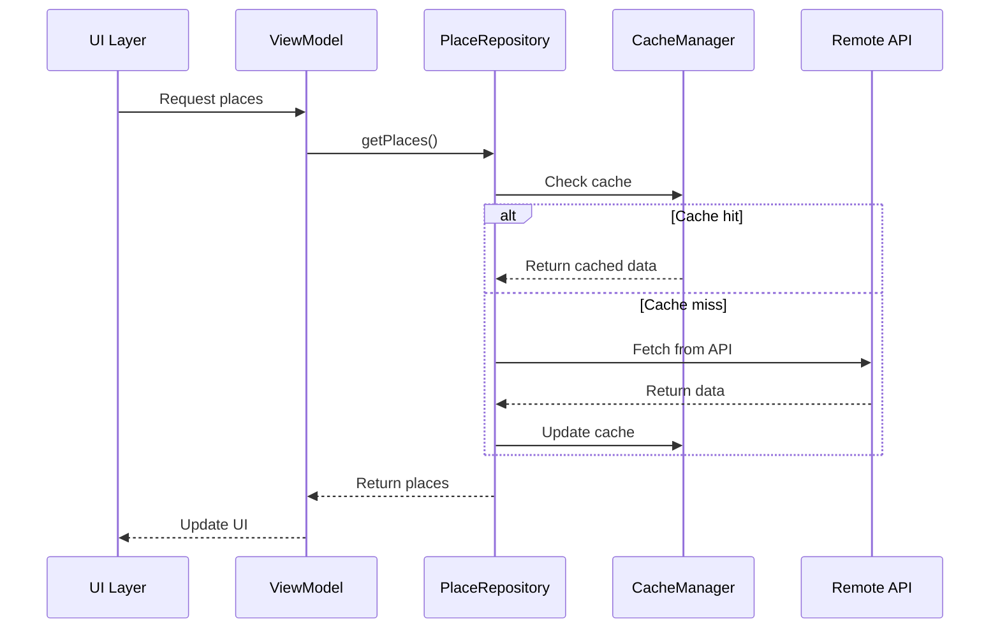
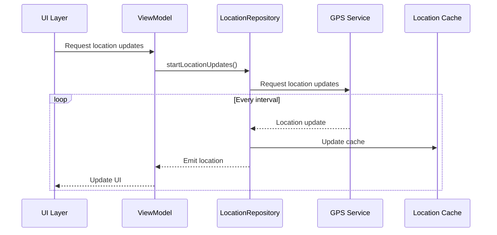
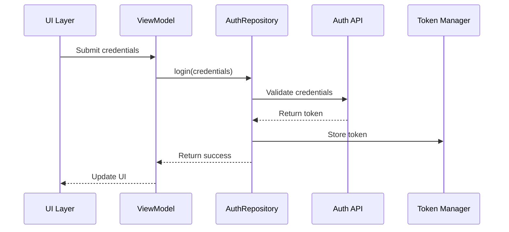
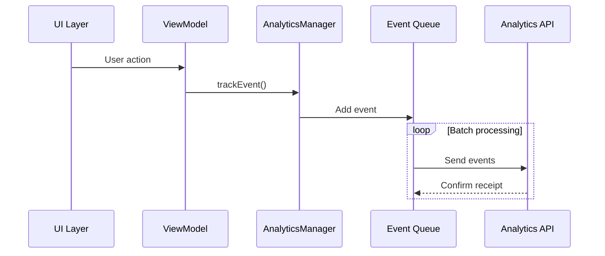

# API Documentation

## Overview

This document provides comprehensive documentation for the Sesame Android application's public APIs,
including interfaces, usage examples, and sequence diagrams for complex interactions.

## Core APIs

### 1. Place Management API

#### PlaceRepository
```kotlin
/**
 * Repository interface for managing places.
 *
 * Features:
 * - CRUD operations for places
 * - Pagination support
 * - Caching
 * - Offline support
 *
 * Usage Example:
 * ```kotlin
 * class PlaceViewModel @Inject constructor(
 *     private val placeRepository: PlaceRepository
 * ) {
 *     suspend fun loadPlaces() {
 *         val places = placeRepository.getPlaces(
 *             paginationParams = PaginationParams(
 *                 page = 1,
 *                 pageSize = 20
 *             )
 *         )
 *     }
 * }
 * ```
 */
interface PlaceRepository {
    /**
     * Retrieves a list of places with pagination support.
     *
     * @param paginationParams Parameters for pagination
     * @return Flow of paginated places
     */
    suspend fun getPlaces(
        paginationParams: PaginationParams
    ): Flow<List<Place>>

    /**
     * Retrieves a specific place by ID.
     *
     * @param placeId The ID of the place to retrieve
     * @return The requested place
     */
    suspend fun getPlace(placeId: String): Place
}
```

#### Sequence Diagram: Place Loading


### 2. Location Services API

#### LocationRepository
```kotlin
/**
 * Repository interface for managing location services.
 *
 * Features:
 * - Location updates
 * - Geocoding
 * - Place search
 * - Location permissions
 *
 * Usage Example:
 * ```kotlin
 * class LocationViewModel @Inject constructor(
 *     private val locationRepository: LocationRepository
 * ) {
 *     suspend fun startLocationUpdates() {
 *         locationRepository.startLocationUpdates(
 *             interval = 5000L,
 *             priority = LocationPriority.HIGH
 *         )
 *     }
 * }
 * ```
 */
interface LocationRepository {
    /**
     * Starts receiving location updates.
     *
     * @param interval Update interval in milliseconds
     * @param priority Location update priority
     * @return Flow of location updates
     */
    suspend fun startLocationUpdates(
        interval: Long,
        priority: LocationPriority
    ): Flow<Location>
}
```

#### Sequence Diagram: Location Updates


### 3. Authentication API

#### AuthRepository
```kotlin
/**
 * Repository interface for managing authentication.
 *
 * Features:
 * - User authentication
 * - Token management
 * - Session handling
 * - Biometric authentication
 *
 * Usage Example:
 * ```kotlin
 * class AuthViewModel @Inject constructor(
 *     private val authRepository: AuthRepository
 * ) {
 *     suspend fun login(credentials: Credentials) {
 *         val result = authRepository.login(credentials)
 *         when (result) {
 *             is AuthResult.Success -> handleSuccess()
 *             is AuthResult.Error -> handleError()
 *         }
 *     }
 * }
 * ```
 */
interface AuthRepository {
    /**
     * Authenticates a user with credentials.
     *
     * @param credentials User credentials
     * @return Authentication result
     */
    suspend fun login(credentials: Credentials): AuthResult
}
```

#### Sequence Diagram: Authentication Flow


### 4. Analytics API

#### AnalyticsManager
```kotlin
/**
 * Manager interface for handling analytics.
 *
 * Features:
 * - Event tracking
 * - User analytics
 * - Performance metrics
 * - Crash reporting
 *
 * Usage Example:
 * ```kotlin
 * class AnalyticsViewModel @Inject constructor(
 *     private val analyticsManager: AnalyticsManager
 * ) {
 *     fun trackUserAction(action: UserAction) {
 *         analyticsManager.trackEvent(
 *             event = AnalyticsEvent(
 *                 name = "user_action",
 *                 properties = mapOf(
 *                     "action" to action.name,
 *                     "timestamp" to System.currentTimeMillis()
 *                 )
 *             )
 *         )
 *     }
 * }
 * ```
 */
interface AnalyticsManager {
    /**
     * Tracks an analytics event.
     *
     * @param event The analytics event to track
     */
    suspend fun trackEvent(event: AnalyticsEvent)
}
```

#### Sequence Diagram: Analytics Tracking


## API Best Practices

### 1. Error Handling
```kotlin
/**
 * Standard error handling pattern for API calls.
 *
 * Usage Example:
 * ```kotlin
 * suspend fun makeApiCall() {
 *     try {
 *         // API call
 *     } catch (e: NetworkException) {
 *         // Handle network error
 *     } catch (e: AuthException) {
 *         // Handle auth error
 *     } catch (e: Exception) {
 *         // Handle unknown error
 *     }
 * }
 * ```
 */
```

### 2. Response Caching
```kotlin
/**
 * Standard caching pattern for API responses.
 *
 * Usage Example:
 * ```kotlin
 * suspend fun getData() {
 *     // Check cache first
 *     val cachedData = cacheManager.get("key")
 *     if (cachedData != null) {
 *         return cachedData
 *     }
 *
 *     // Fetch from API if not in cache
 *     val response = api.getData()
 *     cacheManager.put("key", response)
 *     return response
 * }
 * ```
 */
```

### 3. Rate Limiting
```kotlin
/**
 * Rate limiting implementation for API calls.
 *
 * Usage Example:
 * ```kotlin
 * class RateLimiter {
 *     private val requests = mutableMapOf<String, Long>()
 *
 *     fun shouldAllowRequest(key: String): Boolean {
 *         val now = System.currentTimeMillis()
 *         val lastRequest = requests[key] ?: 0L
 *         return (now - lastRequest) >= RATE_LIMIT_INTERVAL
 *     }
 * }
 * ```
 */
```

## API Versioning

### 1. Version Management
```kotlin
/**
 * API version management strategy.
 *
 * Usage Example:
 * ```kotlin
 * object ApiVersion {
 *     const val CURRENT = "v1"
 *     const val MIN_SUPPORTED = "v1"
 *
 *     fun isSupported(version: String): Boolean {
 *         return version >= MIN_SUPPORTED
 *     }
 * }
 * ```
 */
```

### 2. Backward Compatibility
```kotlin
/**
 * Backward compatibility handling.
 *
 * Usage Example:
 * ```kotlin
 * interface ApiResponse<T> {
 *     val version: String
 *     val data: T
 *
 *     fun toCurrentVersion(): ApiResponse<T> {
 *         return when (version) {
 *             "v1" -> this
 *             else -> migrateToCurrentVersion()
 *         }
 *     }
 * }
 * ```
 */
```

## API Testing

### 1. Unit Testing
```kotlin
/**
 * API unit testing strategy.
 *
 * Usage Example:
 * ```kotlin
 * @Test
 * fun testApiCall() {
 *     // Given
 *     val repository = mockk<Repository>()
 *     every { repository.getData() } returns testData
 *
 *     // When
 *     val result = repository.getData()
 *
 *     // Then
 *     assertEquals(testData, result)
 * }
 * ```
 */
```

### 2. Integration Testing
```kotlin
/**
 * API integration testing strategy.
 *
 * Usage Example:
 * ```kotlin
 * @Test
 * fun testApiIntegration() {
 *     // Given
 *     val api = createTestApi()
 *
 *     // When
 *     val response = api.getData()
 *
 *     // Then
 *     assertTrue(response.isSuccessful)
 *     assertNotNull(response.body)
 * }
 * ```
 */
```

## API Security

### 1. Authentication
```kotlin
/**
 * API authentication implementation.
 *
 * Usage Example:
 * ```kotlin
 * class AuthInterceptor : Interceptor {
 *     override fun intercept(chain: Interceptor.Chain): Response {
 *         val request = chain.request().newBuilder()
 *             .addHeader("Authorization", "Bearer ${getToken()}")
 *             .build()
 *         return chain.proceed(request)
 *     }
 * }
 * ```
 */
```

### 2. Data Encryption
```kotlin
/**
 * API data encryption implementation.
 *
 * Usage Example:
 * ```kotlin
 * class EncryptionManager {
 *     fun encrypt(data: String): String {
 *         return AES.encrypt(data, secretKey)
 *     }
 *
 *     fun decrypt(encryptedData: String): String {
 *         return AES.decrypt(encryptedData, secretKey)
 *     }
 * }
 * ```
 */
``` 